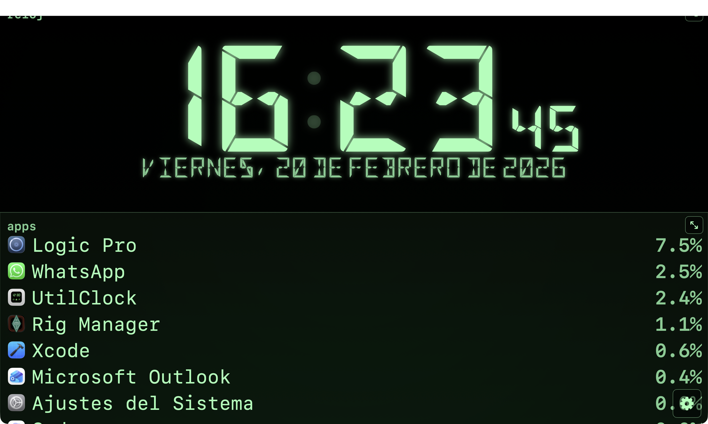
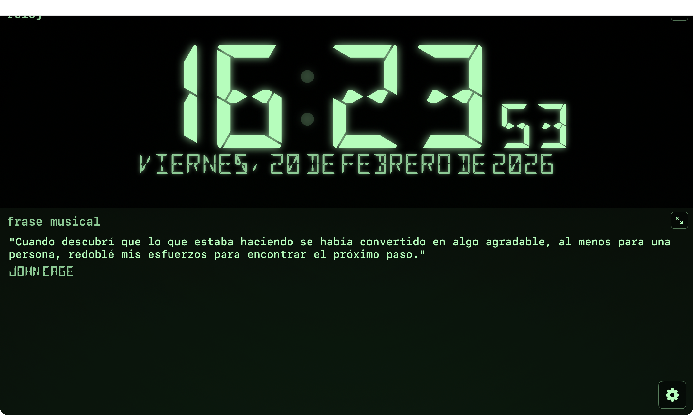
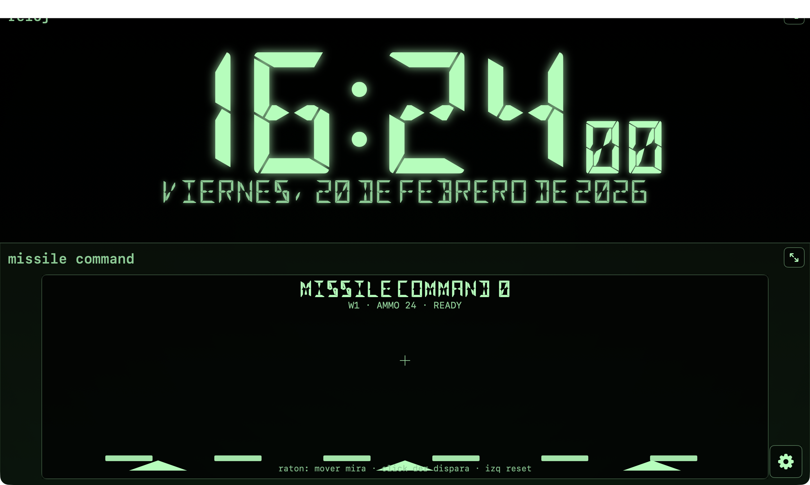
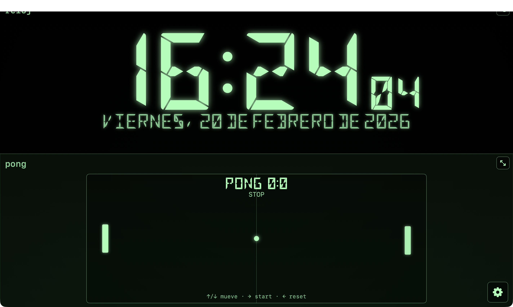
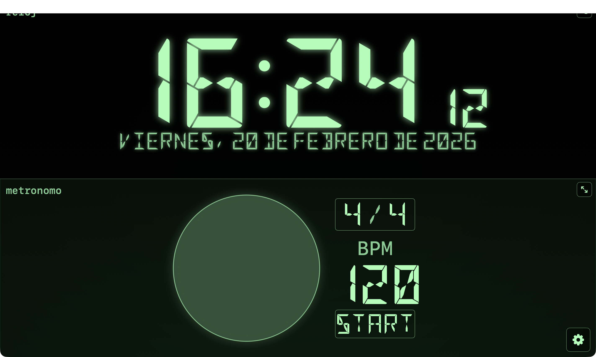
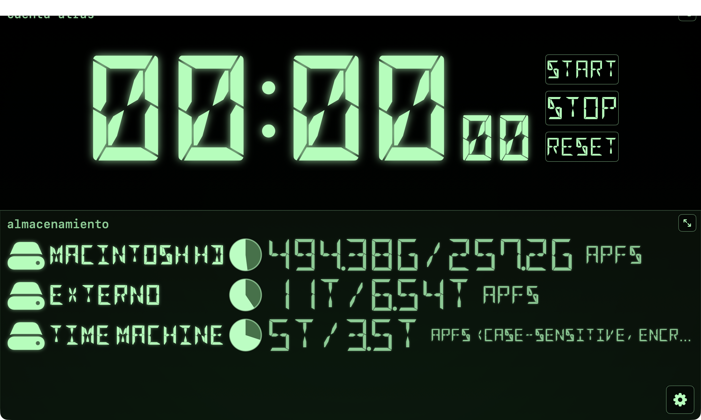

# UtilClock

UtilClock es una app para macOS con estética retro monocroma que combina reloj y utilidades en dos subpantallas.

Esta aplicación se ha desarrollado utilizando **Codex de OpenAI** y está pensada para usarse en pantallas pequeñas, como la **Hagibis**.

## Características

- Subpantalla superior:
  - Reloj
  - Reloj mundial
  - Calendario mensual (navegación por mes y salto a hoy)
  - Tiempo atmosférico actual + previsión en filas
  - Uptime
  - Cronómetro (`mm:ss:cc`)
  - Cuenta atrás
  - Alarma
- Subpantalla inferior (modos configurables):
  - Audio (dispositivo + volumen)
  - Almacenamiento + USB (lista unificada)
  - Red (IP pública/privada y tráfico por interfaz)
  - CPU + memoria
  - Apps + procesos
  - Ver fotos (fuente por álbum o carpeta)
  - Ver vídeos (fuente por carpeta local)
  - Música (launcher: metrónomo, afinador, detector y buscador de acordes)
  - Info (launcher: RAE, frase musical y tal día)
  - Juegos (launcher multi-fila con scroll):
    - Pong, Arkanoid, Snake, Missile Command, Jump n' run (dino),
    - Tetris, Space Invaders, Asteroids, Tron, Pac-Man, Frogger, Artillery
  - Configuración integrada:
  - Activar/desactivar modos
  - Reordenar modos
  - Color del display
  - Ajustes de tamaño para juegos (incluye barra de Arkanoid `1..9`)
  - Opción de viento para Artillery
  - Panel de récords/highscores por juego con opción para reset global a `0`
  - Recordar pantalla de inicio y opción para olvidar selección guardada
  - Elegir presentación de la app: `Dock` o `Barra de menús`

## Novedades recientes (v1.2.6)

- Nuevo modo `Ver Vídeos`:
  - Selección de carpeta con persistencia segura.
  - Lista/cola de reproducción desde archivos locales.
  - Controles integrados de reproducción y barra de progreso.
- Corrección de build:
  - Eliminada referencia duplicada a `doom1.wad` que provocaba fallos de compilación.

## Capturas








## Requisitos

- macOS
- Xcode 15+

## Cronómetro

- Formato: `minutos:segundos:centésimas`.
- Botón principal único: `start/stop`.
- Botón `reset`.
- Botón `pre on/off` para activar la precuenta.
- Si `pre` está activo, antes de arrancar hace una precuenta visual de 3 segundos con overlay grande (`3`, `2`, `1`) y flash.

## Ejecutar en local

1. Abrir `UtilClock.xcodeproj` en Xcode.
2. Seleccionar el esquema `UtilClock`.
3. Ejecutar con `Run` sobre `My Mac`.

## Instalar desde DMG

También se puede usar sin Xcode bajando el instalador `.dmg` desde GitHub Releases:

1. Descargar el `.dmg` de la versión más reciente en [Releases](https://github.com/malvadoficial/UtilClock/releases).
2. Abrir el `.dmg`.
3. Arrastrar `UtilClock.app` a `Applications`.
4. Abrir la app desde `Applications`.

## Build desde terminal

```bash
xcodebuild -project UtilClock.xcodeproj -scheme UtilClock -configuration Debug -sdk macosx build
```

## Publicación (GitHub + Release)

Guía rápida de release: `docs/RELEASE.md`.

### 1) Commit, tag y push

```bash
VERSION="v1.1.3"

git add .
git commit -m "Release ${VERSION}"
git tag -a "$VERSION" -m "UtilClock $VERSION"
git push origin main --follow-tags
```

### 2) Build release firmada

```bash
ROOT="$(pwd)"
OUT="$ROOT/ReleaseBuild"
APP="$OUT/UtilClock.app"
DIST="$OUT/dist"

rm -rf "$OUT/DerivedData" "$APP"
mkdir -p "$DIST"

xcodebuild \
  -project UtilClock.xcodeproj \
  -scheme UtilClock \
  -configuration Release \
  -derivedDataPath "$OUT/DerivedData" \
  CODE_SIGN_STYLE=Manual \
  CODE_SIGN_IDENTITY="Developer ID Application: José Manuel Rives Illán (BJEFHT4S4J)" \
  build

cp -R "$OUT/DerivedData/Build/Products/Release/UtilClock.app" "$APP"
codesign --force --deep --options runtime --timestamp \
  --sign "Developer ID Application: José Manuel Rives Illán (BJEFHT4S4J)" "$APP"
```

### 3) DMG + notarización + staple

```bash
VERSION="v1.1.3"
ROOT="$(pwd)"
OUT="$ROOT/ReleaseBuild"
DIST="$OUT/dist"
DMG_UNSIGNED="$DIST/UtilClock-${VERSION}-macOS.dmg"
DMG_NOTARY="$DIST/UtilClock-${VERSION}-macOS-notary.dmg"

mkdir -p "$OUT/dmg-src"
rm -rf "$OUT/dmg-src/UtilClock.app"
cp -R "$OUT/UtilClock.app" "$OUT/dmg-src/UtilClock.app"

hdiutil create -volname "UtilClock" -srcfolder "$OUT/dmg-src" -ov -format UDZO "$DMG_UNSIGNED"
codesign --force --timestamp --sign "Developer ID Application: José Manuel Rives Illán (BJEFHT4S4J)" "$DMG_UNSIGNED"

# Usa tu perfil real guardado con: xcrun notarytool store-credentials <NOMBRE_PERFIL>
xcrun notarytool submit "$DMG_UNSIGNED" --keychain-profile <NOMBRE_PERFIL> --wait
cp "$DMG_UNSIGNED" "$DMG_NOTARY"
xcrun stapler staple "$DMG_NOTARY"
spctl -a -vvv --type open "$DMG_NOTARY"
```

### 4) Crear release en GitHub CLI

```bash
VERSION="v1.1.3"

gh release create "$VERSION" \
  "ReleaseBuild/dist/UtilClock-${VERSION}-macOS-notary.dmg" \
  --repo malvadoficial/UtilClock \
  --title "UtilClock $VERSION" \
  --generate-notes
```

## Notas

- La app usa entrada de audio para afinador/detección de acordes.
- La captura de audio solo está activa en modos que la necesitan (afinador/detección de acordes).
- Algunas funciones pueden requerir permisos del sistema (micrófono, etc.).
